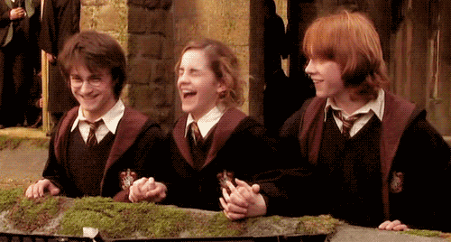

# ⚡️ Me

My name is Harry Potter, and I'm currently living in London, England. I went to Hogwarts School of Witchcraft and Wizardry for magic education, where I made two important friends, Ron and Hermione, and met the love of my life Ginny. Among all the subjects in Hogwarts, my favourite ones are Defence Against the Dark Arts and Flying, while my least favourite is Potions. Well, Snape and I never liked each other. I graduated to be an Auror after the Second Wizarding War.

## 🚉 Early Adventures
### The Philosopher's Stone (1991)
1991 is the year of magic. It is the first time that I got to know about the magic world, Hogwarts the magic school and the beloved headmaster Albus Dumbledore. Later that year, Ron, Hermione and I passed through 6 obstacles to stop someone from stealing the Philosopher's Stone from the underground chamber. We figured out the incident, but guessed the protagonist wrong. It turned out that Voldemort attempted to use Quirinus Quirrell as his servant to steal the Philosopher's Stone. With the help of Professor Dumbledore, we defeated Voldemort and kept the stone safe.

### The Prisoner of Azkaban (1993)
Three things must be mentioned this year. First, I inflated Uncle Vernon's sister, Marge, with the Inflating Charm for her rude words towards my parents. Not a moment in my life have I regretted doing this. Second, we had a new Defence Against the Dark Arts professor (as usual), Remus Lupin. Thanks to this great teacher, I learned how to cast the Patronus Charm to defend myself against the Dementors. Third, I received a new, superb Firebolt broomstick from my god father, Sirius Black. Can you image how happy I was? A Firebolt and a family!

### The Triwizard Tournament (1994)
This period of time was not as pleasant as the past ones. After my name was mysteriously put into the Goblet of Fire and I was chosen as a fourth competitor, not only did I have to finish all the dangerous tasks by myself, but I also had to tolerate all the suspicion from people around, even from my best friend Ron. The worst thing was, at the final event, I had to witness the rebirth of Voldemort and the death of Cedric all alone. This nightmare kept haunting me to this day. 

## 🪄 More
If you want to know more about my story, try muggling [this](https://harrypotter.fandom.com/wiki/Harry_Potter).
