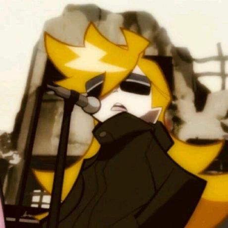

# The Recycle Team
> The Recycle Team makes and supports awesome projects about ♻️Recycling♻️.

## Team Members

### [lem0nle](https://github.com/lem0nle) (Le Dai)
Founder, Software Developer

* 👩‍🎓 I'm a Ph.D. candidate from [USTC](https://ustc.edu.cn), majoring in Computer Science.
* 🥸 My life motto is, *"stay cool and have fun"*.
* 🦆 My name looks like French and sounds like French, but it's actually Chinese.
* 🇩🇪 I've been learning German since 2020.
* 🧙‍♀️ My recent reading list includes Harry Potter and Sherlock Holmes stories.

### [yxonic](https://github.com/yxonic) (Yu Yin)
Founder, Software Architect

* 👨🏻‍💻 I'm a programmer, data scientist, and web designer.
* 🎓 Check out some publications of mine [here](https://base.ustc.edu.cn/publications).
* 🎨 A few things I also enjoy: programming language theory, design and writing.
* 📘 I'm currently working on a book about better programming with Rust.
* 🎸 And I also love playing guitar and bass in my free time.

## Contact Us
### Email (recommended)

|Affair|Contact|
|---|---|
|General|info@recycle.com|
|Marketing|marketing@recycle.com|
|Support|support@recycle.com|

### Tel
* `(+86) 123-4567-8900`
* `(+86) 123-7654-8900`
